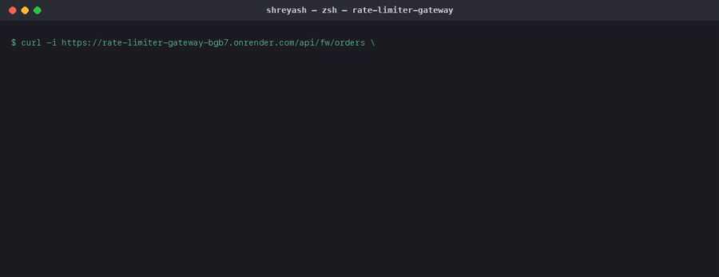

# Distributed Rate Limiter & API Gateway

A standalone gateway that sits in front of any backend, enforcing per-client rate
limits correctly even when the gateway itself is scaled to multiple instances behind
a load balancer — which is exactly the case a naive rate limiter gets wrong.

<p align="center">
  
  <br>
  <em>Live traffic hitting the limit, and the correctness tests that prove it. (<a href="docs/demo.mp4">full-quality video</a>)</em>
</p>

**Try it in 30 seconds** (see it live in the demo above, or run it yourself):

```bash
docker compose up          # starts the gateway + a mock upstream + Redis
curl -i http://localhost:8080/api/fw/hello -H "X-API-Key: demo"
```

Send it 21+ times in a row and watch it start returning `429` after the 20th:

```bash
for i in {1..25}; do curl -s -o /dev/null -w "%{http_code} " http://localhost:8080/api/fw/hello -H "X-API-Key: demo"; done
```

## The problem

Every rate limiter tutorial shows you a single in-memory counter: a request comes in,
you check a number, you increment it. That works exactly once — on a single process.
The moment you run two instances of the gateway behind a load balancer (which is the
normal, expected shape of "a gateway" in production), each instance has its own
independent copy of that counter. A client that's supposed to be capped at 20
requests per 10 seconds gets 20 *per instance* — 60 requests if there are three
instances, without ever technically exceeding what any single instance "saw." The bug
isn't in the counting logic; it's in where the counter lives.

The fix is to move the counter somewhere every instance shares — Redis — and to make
each check-and-increment a single atomic operation there, so concurrent requests from
different gateway instances can never race each other into an inconsistent count.

## Architecture

```
 Incoming request (X-API-Key: abc123)
            │
            ▼
 ┌─────────────────────────────┐
 │  Gateway instance (any one)  │
 │  1. Extract key from header  │
 │  2. Run rate-limit Lua script │───────▶ Redis (atomic INCR/HMSET/
 │     atomically on Redis      │          ZADD via EVALSHA — every
 │  3. Allow → proxy to upstream │         gateway instance evaluates
 │     Deny  → 429 + Retry-After│          the SAME script against the
 └──────────────┬───────────────┘         SAME keys, so state is
                │                          consistent no matter which
                ▼                          instance handled the request)
        Mock upstream service
        (stand-in for "the real backend")

 Prometheus scrapes /metrics on every instance ──▶ Grafana dashboard
```

Three algorithms are implemented and mounted **simultaneously**, each behind its own
path prefix, all enforcing the identical configured limit:

| Route | Algorithm | Redis structure |
|---|---|---|
| `/api/tb/*` | Token bucket | Hash: `{tokens, last_refill_ts}` |
| `/api/sw/*` | Sliding window log | Sorted set: member per request, scored by timestamp |
| `/api/fw/*` | Fixed window counter | Simple integer, keyed by `{apiKey}:{windowBucket}` |

Mounting all three at once — instead of picking one — is deliberate: it means the
exact same load-test traffic pattern can hit all three back to back and produce a
real, apples-to-apples comparison instead of three separate, hard-to-compare runs.

## Tech stack

| Layer | Choice |
|---|---|
| Gateway | Node.js + TypeScript + Express |
| Rate limit store | Redis, atomic counters via Lua scripts (`EVALSHA`, cached automatically by `ioredis`'s `defineCommand`) |
| Algorithms | Token bucket, sliding window log, fixed window counter — all three, benchmarked against each other |
| Routing/proxy | `http-proxy-middleware` (Node's `http` under the hood, same idea as `httputil.ReverseProxy`) |
| Observability | `prom-client` exposing per-algorithm request counts, a limiter-check histogram *and* a separate end-to-end histogram, plus fail-open and upstream-error counters; Prometheus + a Grafana dashboard provisioned from this repo |
| Load testing | k6, with a custom scenario per algorithm sharing a small API-key pool to force real contention |
| Deployment | Docker Compose locally (two gateway replicas + Redis + mock upstream + Prometheus + Grafana); Render in production |

## The hardest decisions

### 1. Atomicity is the entire project — everything else is plumbing

The failure mode this project exists to prevent: gateway instance A does `GET
counter` (reads 19), gateway instance B does `GET counter` (also reads 19, a moment
later but before A writes back), both decide "19 < 20, allow it," both do `SET
counter 20`. Two requests just got allowed on what should have been the 20th and
last slot — the classic **check-then-act race condition**, and it happens *between*
two separate machines, so no amount of in-process locking fixes it.

The fix isn't "use a fancier data structure" — it's moving the entire
read-decide-write sequence into a single Lua script that Redis runs to completion,
uninterrupted, before processing any other command (including another invocation of
the same script from a different gateway instance). See `src/scripts/tokenBucket.lua`
— the comment at the top of that file spells out exactly why the naive version
breaks. `scripts/multi-instance-test.mjs` proves the fix: it spins up two real
gateway processes on different ports sharing one Redis, fires 3x the configured limit
worth of requests alternating between them with the same API key, and asserts the
total allowed across *both instances combined* equals the limit — not double it.
That test passing is the actual deliverable of this project; everything else is
scaffolding around it.

### 2. Fixed window's boundary burst isn't a bug — it's a documented, measured trade-off

Fixed window counters reset on a clock boundary (e.g., every 10 seconds, on the
10-second mark). A client can send `limit` requests in the last millisecond of one
window and another `limit` in the first millisecond of the next — two allowed bursts,
milliseconds apart, adding up to 2x the intended rate over that span. This is a
known, named weakness of the algorithm, not an implementation bug, and I didn't want
to just assert that in a comment — `scripts/boundary-burst-test.mjs` reproduces it on
purpose: it aligns requests to land right at a real window boundary, fires a full
`limit` batch on each side of it, and measures the result. On my machine: **fixed
window allowed 10 requests against a configured limit of 5** (exactly the 2x burst),
while **sliding window log, given the identical timing pattern, correctly held at 5**
— because it has no fixed boundary to exploit; it always looks back exactly `window`
milliseconds from *now*. That's the actual trade-off, measured, not just described.

The cost sliding window pays for that correctness: memory. It stores one sorted-set
entry per request in the trailing window, vs. fixed window's single integer. For a
high-limit, high-traffic key, that's a real difference worth knowing before picking
one in an interview — "sliding window is strictly better" isn't the right answer;
"sliding window is more correct at the boundary but costs O(requests-in-window)
memory instead of O(1)" is.

### 3. Fail open, not closed — and "fail open" is a latency claim, not just a status code

If the rate-limit check can't reach Redis, the gateway logs the error and lets the
request through rather than returning a 500 (see `rateLimitMiddleware.ts`). The
reasoning: a rate limiter that's temporarily too permissive is a minor, self-correcting
problem, while a gateway that takes its *entire upstream* down because its rate-limit
dependency sneezed is a much bigger incident, and defeats half the purpose of putting a
gateway in front of the backend at all.

The part worth spelling out is that I originally got this wrong while believing I'd got
it right. The `try/catch` was there and the fallback was correct, but the ioredis client
was constructed with defaults — and ioredis defaults to `enableOfflineQueue: true` and
`maxRetriesPerRequest: 20`. Those two settings mean that while Redis is unreachable,
commands don't fail: they get parked in an in-memory queue and dragged across twenty
reconnect attempts before the promise ever rejects. The `catch` block was correct and
almost never ran in time. Pointing a gateway at a dead Redis and timing individual
requests:

```
status=200  time=7.09s
status=200  time=2.50s
status=000  time=30.00s    ← client gave up first
```

Every one of those technically failed open. All of them were useless. A gateway adding
seconds of latency to every request is down, whatever status code it eventually returns —
and worse than an honest 500, because it's down while looking healthy. **Failing open is
a latency claim, not just a status-code claim**, and it needs the client configured to
reject fast (`enableOfflineQueue: false`, `maxRetriesPerRequest: 1`) plus a
`commandTimeout` to cover the other case — a Redis that's up but slow, where no amount of
connection handling helps. Same experiment after the fix:

```
p50 2.3ms   p95 4.0ms   max 8.8ms   (20/20 served)
```

`scripts/redis-outage-test.mjs` is that experiment, automated and run in CI, so the
regression can't come back quietly. It also asserts two things I'd consider part of the
same decision:

- **The fail-open is counted.** `gateway_requests_total{outcome="failed_open"}` and
  `gateway_limiter_errors_total{reason="timeout"|"unavailable"}`. An *uncounted*
  fail-open is arguably worse than a hard failure — the gateway silently stops enforcing
  limits and every dashboard stays green. Responses also carry
  `X-RateLimit-Enforced: false` so the client knows it wasn't actually limited.
- **`/health` and `/ready` disagree, on purpose.** Liveness stays 200 during a Redis
  outage (if it didn't, the orchestrator would restart every replica over a dependency
  the gateway is specifically built to survive) while readiness returns 503 (the gateway
  isn't enforcing anything, and shouldn't claim it is).

Fail-open is still a real trade-off, not a free choice — a login endpoint might
reasonably want the opposite, rejecting rather than risking unlimited unauthenticated
traffic during an outage. Worth stating which one you picked and why, rather than letting
it be an accident.

### 4. Measuring the limit check and measuring the request are different questions

The gateway used to record its latency histogram before calling `next()`, which meant the
number labelled "end-to-end duration including the proxy hop" contained no proxy hop at
all — just the Redis round-trip. It isn't that the number was wrong; it's that it was
answering a different question than its name claimed, which is the kind of metric that
survives review precisely because nobody re-derives what it measures.

There are two questions here and they deserve two histograms:

| | token bucket | sliding window | fixed window |
|---|---|---|---|
| `gateway_limiter_check_duration_seconds` (Redis round-trip) | 1.02ms | 0.59ms | 0.54ms |
| `gateway_request_duration_seconds` (observed on response finish) | 5.91ms | 3.44ms | 3.37ms |
| difference — the upstream's contribution | 4.89ms | 2.85ms | 2.83ms |

*(means over allowed requests, from the k6 run below.)*

The first column is the only one the gateway is accountable for, and the right number for
comparing algorithms against each other. The second is what a client actually experiences.
Reporting the first as if it were the second makes the gateway look ~5x faster than it is.

### 5. The gateway needs protecting from the things it's protecting

A gateway sits between two parties it doesn't control, and it was trusting both of them
more than it should have. Three separate versions of the same mistake, each found by
pointing something hostile at a running instance rather than by reading the code:

**A hung upstream held gateway sockets forever.** Not a *slow* upstream — one that
accepts the connection and then never answers, which is what a saturated backend
actually looks like. There was no `proxyTimeout`, so the gateway waited indefinitely;
in the measurement the client gave up first, at 25 seconds. The component whose entire
purpose is protecting the backend had no protection *from* the backend, and would
exhaust its own connections on behalf of a service already failing. Now bounded by
`UPSTREAM_TIMEOUT_MS`, returning a counted 504 in ~1s.

Worth noting the shape of that fix, because the obvious version is wrong: setting
http-proxy-middleware's `timeout` alongside `proxyTimeout` made it *worse*. `timeout`
applies to the incoming socket, and it fired first and destroyed the connection without
ever reaching the error handler — the client got a dead socket instead of a 504, and
nothing was logged or counted. Slow clients and slow upstreams are different problems;
only one of them is what this deadline is for.

**Clients could dictate Redis key size.** The API key header goes straight into the Redis
key, with no bound on its length. A 7,000-character header produced a 7,018-byte Redis
key, and was accepted — every distinct value buying another one. A rate limiter, of all
things, turned into a memory amplifier aimed at the store it depends on. Key material is
now capped at 128 characters, with anything longer hashed: bounded, but still a stable
per-client bucket, so an unusual-but-legitimate key is limited consistently instead of
being handed a fresh bucket per request. Ordinary keys stay readable — hashing everything
would make every key in Redis opaque to debug for no added safety.

**Readiness was reporting the wrong thing during a deploy.** `/ready` correctly flipped to
503 on SIGTERM — and then `server.close()` ran immediately, so health checks got a
connection refusal rather than that 503. The load balancer learned the instance was going
away by failing a real request instead of by failing a probe, which is the exact
client-visible error the probe exists to prevent. `READINESS_DRAIN_MS` now keeps the
listener open, still serving traffic, while reporting not-ready — verified as 503 on
`/ready` and 200 on live requests, simultaneously.

One thing I expected to find here and didn't: keep-alive connections blocking graceful
shutdown, which is a real bug in this pattern on older Node. Node 19 changed
`server.close()` to drop idle connections, and a direct test confirmed a held-open
keep-alive socket doesn't delay exit on Node 22. Left alone rather than "fixed."

## Verifying it yourself

Nineteen unit tests cover the limiters directly — each algorithm's boundaries, and an atomicity
test that fires 50 simultaneous checks at one key and asserts exactly `limit` get
through (a read-decide-write implementation passes every sequential test and fails that
one). They run against a real Redis rather than a mock, because the logic under test
lives inside Lua that Redis executes — a fake client would only be asserting against a
reimplementation of the thing being tested.

```bash
npm test                       # limiters + the HTTP header/fail-open contract
```

Then three scripts exercise the actual running gateway, each spinning up its own
throwaway gateway/upstream processes on dedicated ports so a run can't collide with
anything else you have going:

```bash
npm run test:multi-instance    # two gateway instances, one Redis: proves the shared limit holds
npm run test:boundary-burst    # measures fixed window's boundary burst vs sliding window's lack of one
npm run test:redis-outage      # kills Redis: proves fail-open is fast, counted, and visible in /ready
```

And the k6 load test, which needs a gateway actually running first:

```bash
npm run dev &          # gateway on :8080
npm run mock-upstream & # upstream on :9000
k6 run loadtest/compare-algorithms.js
```

Real numbers from a local run (limit=5/10s, 10 VUs per algorithm for 20s each, 5
shared API keys to force contention): **195 requests allowed, 10,928 correctly
rejected, 0% failure rate** (every response was a valid 200 or 429 — the 429s are the
rate limiter working, not the gateway breaking), client-observed p95 4.5ms. The
server-side split behind that number is in decision #4 above.

Everything here runs in CI on every push, against a real Redis service container.

## Running locally

Requires Redis (`brew install redis && brew services start redis`, or `docker compose
up -d redis`).

```bash
cp .env.example .env
npm install
npm run mock-upstream    # terminal 1 — the backend being protected, on :9000
npm run dev               # terminal 2 — the gateway, on :8080

curl -i http://localhost:8080/api/tb/hello -H "X-API-Key: demo"   # token bucket
curl -i http://localhost:8080/api/sw/hello -H "X-API-Key: demo"   # sliding window
curl -i http://localhost:8080/api/fw/hello -H "X-API-Key: demo"   # fixed window

curl http://localhost:8080/health     # liveness — 200 even if Redis is down
curl http://localhost:8080/ready      # readiness — 503 when limits aren't being enforced
curl http://localhost:8080/metrics    # Prometheus format
```

Every rate-limited response carries enough for a client to behave well without guessing,
in both the IETF draft spelling and the de-facto `X-` one:

```
RateLimit-Limit: 20        # what you get
RateLimit-Remaining: 17    # what's left right now
RateLimit-Reset: 8         # seconds until your full budget is back
Retry-After: 3             # (429s only) seconds until this request would succeed
```

`Reset` and `Retry-After` answer different questions and are deliberately not the same
number: a client one token short can retry long before its whole budget returns. For the
sliding window that retry time comes from when the *oldest* logged request ages out —
returning the full window instead, the obvious shortcut, tells every client to wait the
maximum even when it was a millisecond from a free slot.

## What I'd change at 10x scale

- **No per-endpoint or per-tier limits.** Every API key gets the same limit today
  (`RATE_LIMIT`/`RATE_WINDOW_SECONDS`, global). A real gateway needs per-route limits
  (a search endpoint and a health check shouldn't share a budget) and per-plan limits
  (free tier vs. paid tier) — both are a config/lookup layer on top of the same
  atomic-script foundation, not a rework of it.
- **Fail-open is a global policy today; it should be a per-route choice** (see
  decision #3) — auth endpoints and payment endpoints likely want fail-closed even
  though the general API doesn't.
- **No distributed tracing.** Prometheus metrics show *that* the gateway is
  rejecting a spike, not which upstream call chain triggered it. Wiring in
  OpenTelemetry (same pattern as the event-driven order system project) would close
  that gap.
- **Single Redis instance is a single point of failure.** At real scale this needs
  Redis Cluster or a managed equivalent (ElastiCache, Upstash) with the gateway's
  Lua scripts confirmed to work against a clustered keyspace (cross-slot operations
  need care — each of these scripts only ever touches one key, which keeps them
  cluster-safe as written, but that constraint would need to stay enforced
  deliberately as the scripts evolve).

## Deployment

**How it's deployed:** two separate Render free web services — `rate-limiter-gateway`
and `rate-limiter-mock-upstream` — both deployed from this repo's `main` branch, plus
a shared free-tier Redis instance (reused from another one of my projects; its key
namespace here — `tb:*`/`sw:*`/`fw:*` — doesn't collide with anything else using that
instance). `RATE_LIMIT`, `RATE_WINDOW_SECONDS`, `REDIS_URL`, `UPSTREAM_URL` are set as
Render environment variables — see `.env.example` for the full list.

**One deployment setting that's a correctness bug if you skip it:** `TRUST_PROXY`. The
limiter falls back to keying on client IP when no API key is present, and behind a load
balancer the socket's remote address is the *balancer's* IP for every single client —
so with the default setting every anonymous caller in the world shares one bucket. Set it
to the number of proxy hops in front of the gateway (`1` on Render). Not to `true`: that
trusts the whole `X-Forwarded-For` chain, which lets a client prepend a fake address and
mint itself a fresh bucket per request.

**`READINESS_DRAIN_MS` is the other deployment-shaped one** — it defaults to 0 so local
runs exit instantly, which is the wrong value behind a load balancer. Set it to at least
twice the health-check interval so the balancer sees `/ready` return 503 and stops
routing before the socket closes (see decision #5).

**Known trade-off of the free-tier deployment:** Render's free web services spin down
after 15 minutes idle; the first request after that takes ~30-50s to cold-start. If
the curl command above hangs for a bit on your first try, that's why — not a bug.
The gateway's own rate limiting is unaffected either way, since it's enforced in
Redis, not in the gateway process's memory.

**To deploy your own copy:** provision Redis, deploy `src/mockUpstream.ts` (or your
own real backend) as one service, deploy the gateway as a second long-lived Node
process pointed at it via `UPSTREAM_URL`, and you're done — no database, no
migrations, just the one Redis dependency.

**Locally**, `docker-compose.yml` runs the full picture: two gateway replicas
(`gateway-a`, `gateway-b`) sharing one Redis, a mock upstream, Prometheus scraping
both replicas, and Grafana on top — `docker compose up` reproduces the multi-instance
story from decision #1 as an actual running system, not just a test script.

Grafana's datasource and dashboard are provisioned from `grafana/` in this repo, so
<http://localhost:3000> opens straight onto a populated dashboard rather than an empty
instance asking you to wire one up by hand. It leads with the number that's easy to miss
otherwise — requests currently being served *unenforced* because the limiter can't reach
Redis — alongside the per-algorithm decision rates and the two latency histograms from
decision #4.

## License

MIT
